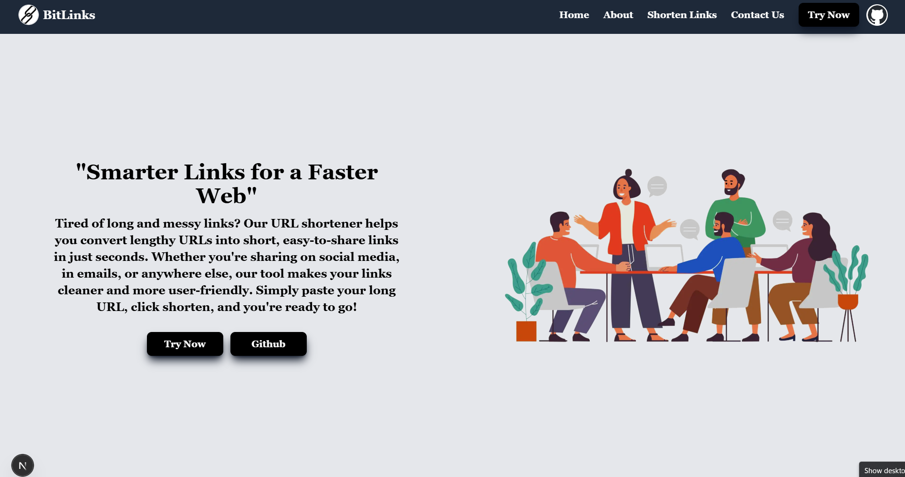
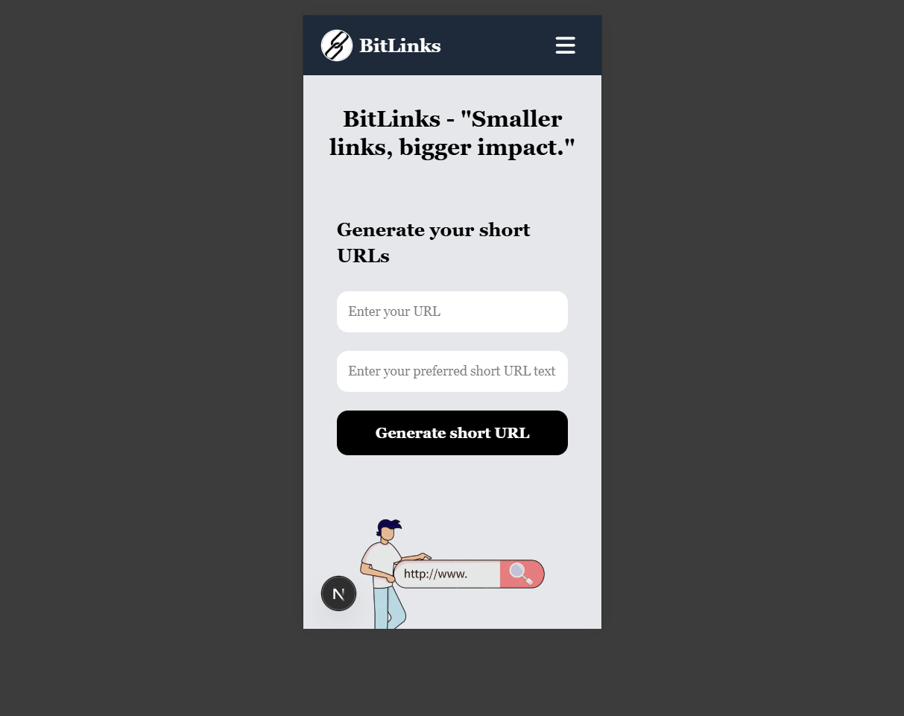
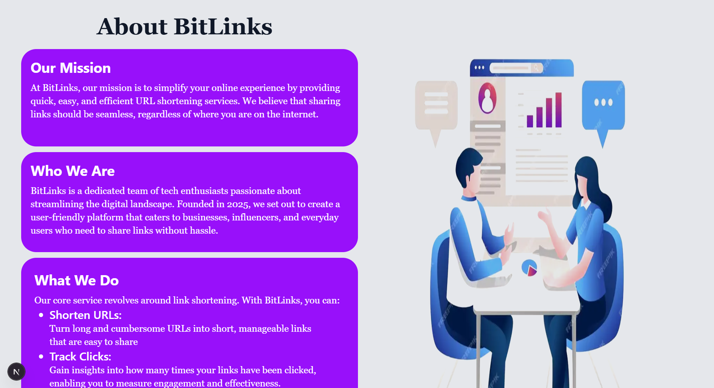
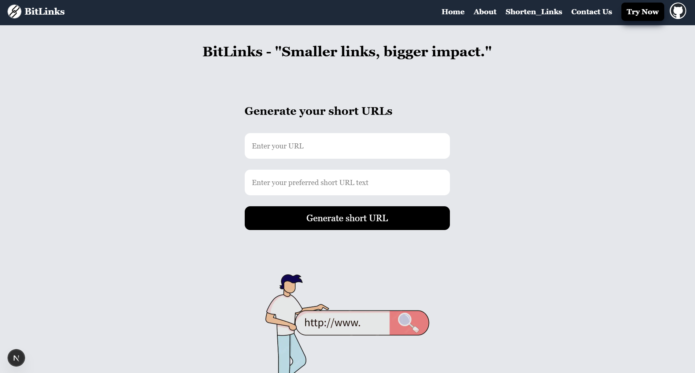
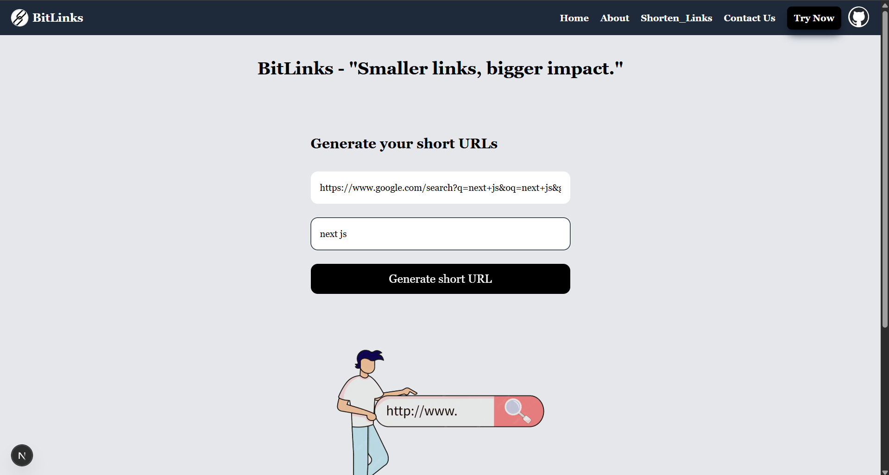
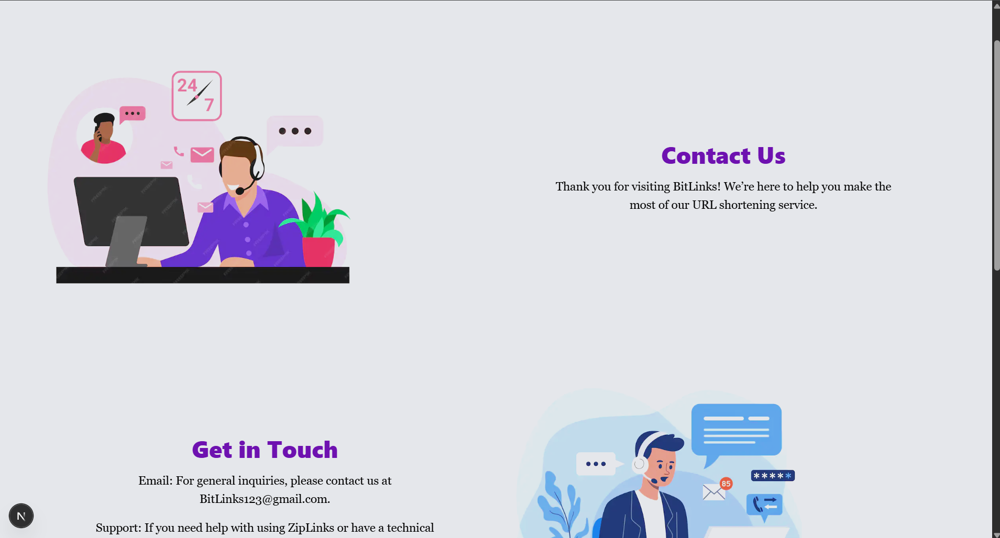

# Bitlinks

### Modern URL Shortening & Custom Alias Management Web Application

Bitlinks is a fast, responsive, and full-stack URL shortening web application built with Next.js, React, and MongoDB. It allows users to convert lengthy, complex web addresses into clean, memorable, and manageable short links with custom aliases.

When visitors access a generated short link, the application dynamically resolves the custom slug and redirects them directly to the original target URL.

---

<p align="left">
  
  
  
  
  
  
</p>

---

## Table of Contents

- [Overview](#overview)
- [Key Features](#key-features)
- [Live Demonstration](#live-demonstration)
- [Screenshots & Previews](#screenshots--previews)
- [Application Architecture](#application-architecture)
- [Project Directory Structure](#project-directory-structure)
- [Tech Stack & Tools](#tech-stack--tools)
- [Environment Variables](#environment-variables)
- [Installation & Local Setup](#installation--local-setup)
- [Available Scripts](#available-scripts)
- [API Endpoints](#api-endpoints)
- [How It Works](#how-it-works)
- [Future Enhancements](#future-enhancements)
- [Author & Contact](#author--contact)
- [License](#license)

---

## Overview

In today's digital landscape, sharing long and cumbersome URLs leads to broken links, cluttered messages, and poor user experiences. **Bitlinks** addresses this by providing a reliable link management service where users can:

1. Paste any valid long destination URL into the input field.
2. Define a custom, human-readable short alias/slug (e.g., `bitlinks.com/my-portfolio`).
3. Generate and store the mapping securely in a database.
4. Instantly redirect visitors who navigate to the short URL to the original destination.

The application leverages the Next.js App Router for dynamic routing, serverless API handling, and optimized performance.

---

## Key Features

- **Long URL Shortening**: Instantly convert long, complex URLs into concise links.
- **Custom Short Link Names (Aliases)**: Choose meaningful, branded, or easy-to-remember short slugs rather than random character strings.
- **Dynamic Redirection**: Fast server-side resolution and redirection to target destinations.
- **Duplicate Alias Prevention**: Validates slug availability in real time to prevent collisions and overwrites.
- **Clipboard Integration**: One-click copying of generated short links for seamless sharing.
- **Responsive Interface**: Mobile-first design crafted with Tailwind CSS for smooth usage across desktops, tablets, and mobile devices.
- **Persistent Database Storage**: Structured data persistence using MongoDB and Mongoose.
- **Input Validation & Error Handling**: Comprehensive validation for valid URL formats and reserved paths.

---

## Live Demonstration

You can explore the deployed application here:

- **Live Application**: [bitlinks-seven-alpha.vercel.app](https://bitlinks.vercel.app) 
- **API Health Check**: [https://bitlinks-seven-alpha.vercel.app/shorten]

---

## Screenshots & Previews

<details>
<summary><strong>Home </strong></summary>



<br>

</details>

<br>

<details>
<summary><strong>Footer</strong></summary>

<br>


</details>

<br>

<details>
<summary><strong>Mobile </strong></summary>



<br>

</details>

<br>

<details>
<summary><strong>About</strong></summary>

<br>




</details>

<br>

<details>
<summary><strong>Bitlinks</strong></summary>

<br>




</details>

<br>

<details>
<summary><strong>Generate</strong></summary>

<br>




</details>

<br>

<details>
<summary><strong>Contact</strong></summary>

<br>




</details>

---

## Application Architecture

```
[ User Browser ]
       |
       | 1. Submits Long URL + Custom Alias
       v
[ Next.js Frontend (App Router) ]
       |
       | 2. POST /api/generate
       v
[ Serverless API Route ]
       |
       | 3. Query / Insert Record
       v
[ MongoDB Database ]
       |
       | 4. Returns Success & Short URL Link
       v
[ User Receives Short Link ]
       |
       | 5. Navigates to /[shorturl]
       v
[ Next.js Dynamic Route Resolver ]
       |
       | 6. Fetches original URL from MongoDB
       v
[ 301/307 Redirect to Target URL ]
```

---

## Project Directory Structure

```text
bitlinks/
├── app/
│   ├── api/
│   │   └── generate/
│   │       └── route.js        # API route handling short link creation & validation
│   ├── [shorturl]/
│   │   └── page.js             # Dynamic route handling short link redirection
│   ├── favicon.ico             # Application favicon
│   ├── globals.css             # Global CSS and Tailwind directives
│   ├── layout.js               # Root layout with metadata and providers
│   └── page.js                 # Landing page and URL shortening UI
├── components/
│   ├── Navbar.js               # Navigation header component
│   └── Footer.js               # Footer component with attribution links
├── lib/
│   └── mongodb.js              # Cached MongoDB client connection utility
├── models/
│   └── Url.js                  # Mongoose schema and model definition for URLs
├── public/
│   ├── screenshots/            # Repository and documentation preview assets
│   └── logo.svg                # Application branding assets
├── .gitignore                  # Git ignore specifications
├── jsconfig.json               # JavaScript path aliases and compiler configuration
├── next.config.mjs             # Next.js runtime and build configuration
├── package.json                # Project dependencies and operational scripts
├── package-lock.json           # Locked dependency tree
├── postcss.config.mjs          # PostCSS configuration for Tailwind CSS
└── README.md                   # Project documentation
```

---

## Tech Stack & Tools

### Frontend
- [](https://react.dev/) - Component-based user interface library
- [](https://nextjs.org/) - React framework for production and server-side rendering
- [](https://tailwindcss.com/) - Utility-first CSS styling framework

### Backend & Database
- [](https://nodejs.org/) - JavaScript runtime environment
- [](https://www.mongodb.com/) - Document-oriented NoSQL database
- [](https://mongoosejs.com/) - Object data modeling library for MongoDB

### Deployment & Tooling
- [](https://vercel.com/) - Edge deployment and hosting platform
- [](https://git-scm.com/) - Distributed version control system
- [](https://github.com/) - Source code repository hosting

---

## Environment Variables

To run Bitlinks locally, you must configure the required environment variables. Create a `.env.local` file in the root directory:

```env
# MongoDB Connection String
MONGODB_URI=mongodb+srv://<username>:<password>@cluster.mongodb.net/bitlinks?retryWrites=true&w=majority

# Base URL of the deployment
NEXT_PUBLIC_HOST=http://localhost:3000
```

---

## Installation & Local Setup

### Prerequisites

Ensure you have the following installed on your local machine:
- Node.js (v18.17.0 or higher recommended)
- npm, yarn, or pnpm
- A running MongoDB instance or MongoDB Atlas connection URI

### Step-by-Step Installation

1. **Clone the repository:**
   ```bash
   git clone https://github.com/ArafatAli-07/bitlinks.git
   cd bitlinks
   ```

2. **Install project dependencies:**
   ```bash
   npm install
   ```

3. **Configure Environment Variables:**
   Create a `.env.local` file in the root folder as described in the [Environment Variables](#environment-variables) section.

4. **Run the local development server:**
   ```bash
   npm run dev
   ```

5. **Access the application:**
   Open your browser and navigate to `http://localhost:3000`.

---

## Available Scripts

In the project directory, you can execute the following commands:

| Command | Description |
| :--- | :--- |
| `npm run dev` | Starts the Next.js development server with hot-reloading on port 3000. |
| `npm run build` | Compiles the production build and optimizes server assets. |
| `npm run start` | Launches the production server after executing `npm run build`. |
| `npm run lint` | Runs ESLint to check for code quality and syntax errors. |

---

## API Endpoints

### 1. Generate Short URL

Creates a shortened URL mapping with a custom alias.

- **Endpoint:** `/api/generate`
- **Method:** `POST`
- **Headers:** `Content-Type: application/json`

**Request Body:**
```json
{
  "url": "https://example.com/very/long/nested/path/to/resource",
  "shorturl": "my-custom-slug"
}
```

**Success Response (`200 OK`):**
```json
{
  "success": true,
  "error": false,
  "message": "Short URL generated successfully"
}
```

**Error Response (`400 Bad Request` or `409 Conflict`):**
```json
{
  "success": false,
  "error": true,
  "message": "URL with this short name already exists!"
}
```

---

### 2. URL Redirection

Resolves the short slug and redirects the visitor.

- **Endpoint:** `/[shorturl]`
- **Method:** `GET`
- **Behavior:** Looks up the document matching `shorturl` in the database:
  - If found: performs a direct redirect (`307 Temporary Redirect` or `301 Permanent Redirect`) to the original destination.
  - If not found: renders a 404 / Not Found page.

---

## How It Works

1. **Submission**: The user enters the original long URL into the destination input field and enters a preferred custom slug in the short link alias field.
2. **Sanitization & Check**: The frontend submits the payload to `/api/generate`. The backend validates the inputs, checks against existing short aliases in the MongoDB collection, and saves the new record.
3. **Link Generation**: A full shortened URL is constructed (e.g., `http://localhost:3000/my-custom-slug`) and returned to the user interface.
4. **Resolution**: When any user visits `http://localhost:3000/my-custom-slug`, the dynamic route handler `app/[shorturl]/page.js` queries MongoDB for `shorturl: "my-custom-slug"` and redirects the client to the stored original URL.

---

## Future Enhancements

- **Analytics Dashboard**: Track total click counts, referral sources, and geographic locations for each link.
- **QR Code Generation**: Automatically generate downloadable QR codes for created short links.
- **User Authentication**: Allow users to register and manage their complete link portfolio.
- **Link Expiration**: Set optional time-based expiration dates on generated links.
- **Custom Password Protection**: Allow users to protect links with a security passphrase.

---

## Author & Contact

- **Name**: Arafat Ali
- **GitHub**: [](https://github.com/ArafatAli-07)
- **LinkedIn**: [](https://www.linkedin.com/in/arafat-ali-dev)
- **Portfolio**: [](https://your-portfolio.com)